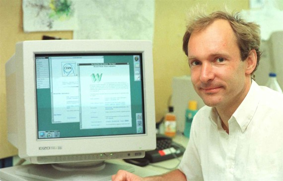

# 1.2: Web Browsers

## Learning Objectives

By the end of this lessons, you should be able to:

* Explain what a web browser is in your own words.
* Explain what role browsers play in this course, and why we use them.
* Make simple edits to a HTML file and see those changes reflected in your browser.

## Introduction



## Why Browsers

Web browsers are tools to view web pages and not necessary for writing and executing code. In Coding Basics we will use browsers as a _learning tool_ to visualise inputs and outputs of our code through a web page.

## Web Browser History

The World Wide Web and web browsers were born in 1990 when Tim Berners-Lee invented a way to view HTML documents through the Internet.

## HTML

The fundamental thing a browser did in 1990 was download and view HTML web site pages. HTML stands for HyperText Markup Language, and is the basic building block of the Web. HTML is **not** a programming language, but is still core to the functionality of how a browser works, so we are going to start there.

## Exercises

### Run Starter Code in Browser

1. Download a compressed ZIP file from [this link](https://github.com/rocketacademy/swe101-starter-code/archive/main.zip).
2. If you haven't already, create a `basics` folder in a local folder, e.g. `Documents`.
3. Move the downloaded .zip file to the `basics` folder.
4. Unzip the file - it should create a new `basics-starter-code` folder. The starter code files are in this folder.
5. Open the `index.html` file in Chrome. Double click it if Chrome is your default browser. Or, you can right click to open in Chrome.

### Change HTML Text on Page

1. Change line `62` (Basics!) to something else. Make sure to save the file before you refresh.
2. Change the text of the button on line `72`.
