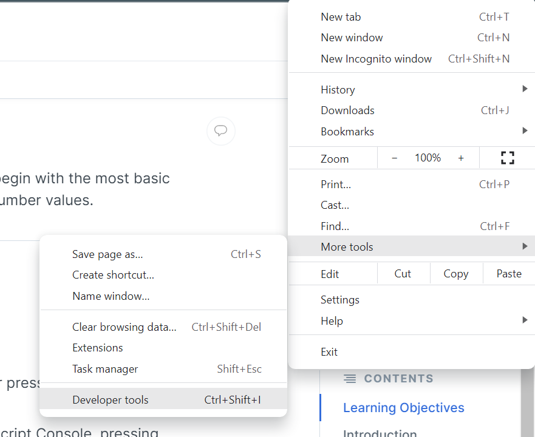

# 2: Operators and Expressions

## Learning Objectives

* Define a "code expression".
* Understand the operator's function within a code expression
* Use the Chrome DevTools Console to begin writing code expressions

## Video



## Introduction

This module is the beginning of our programming journey!&#x20;

Programming is the act of writing code (instructions) for the computer to execute sequentially. It is the same as written instructions for a cooking recipe!

<figure><figcaption><p>pancakes ftw!</p></figcaption></figure>

We will first start with learning how to write single lines of code before stringing them together into a bigger whole. Before long, you will be creating multi-line programs of your own!&#x20;

#### **Code Expression**

An expression is a **"valid unit of code that resolves to a value"**.

This does mean that there are invalid code that are "unresolvable" and will give errors - something that will be discussed at a later time.

There are two kinds of code expressions - (1) those that purely evaluate; (2) those that have a "side effect".

We are familiar with the expressions that purely evaluate. These are the arithmetic expressions we learnt in school:  `5 + 6` . This, we understand, evaluates itself to `11`.

An example of the second type expression type is this: `a = 3` . This expression enters into a new, yet understandable realm. This expression uses the `=` _operator_ to assign the value `3`to the variable `x`. This expression will evaluate to `3`.

We will look into these expressions in greater detail within the sub-modules. At this point we want to first have a space to experiment with code...

## Using Chrome DevTools Console

The reason we ask every student to use Google Chrome for this course is to both standardise the tools everyone uses and, in our current context, this functionality we are exploring to begin our foray into programming.&#x20;

Feel free to read up more on [Google's own documentation](https://developer.chrome.com/docs/devtools/console/)!

#### **Setup**

1. Open a new tab in the Chrome browser by clicking File > New Tab; or pressing `Cmd+T` for Mac, and `Ctrl+T` for Windows.
2. Open Chrome Developer Tools by clicking View > Developer > JavaScript Console; or pressing `Cmd+Option+I` for Mac or `Ctrl+Shift+I` for Windows; or `F12`; or right-clicking anywhere in Chrome and clicking Inspect.
3. Select the `Console` tab in Chrome Dev Tools.



<figure><figcaption><p>Console tab in Chrome DevTools</p></figcaption></figure>

## Try

The JavaScript language is capable of performing math operations. Enter the following calculations into the Chrome DevTools Console, followed by the `Enter` key.


```javascript
2 + 2;
```

```javascript
4 * 2;
```

```javascript
4 / 2;
```

```javascript
4 - 2;
```

The input here is a mathematical equation typed in by the user, you. You have _instructed_ the computer to perform a mathematical operation. The computer \_**returned** \_ an output, the evaluation of the equation.


These exercises may seem trivial, but mathematical operations are at the core of all computing instructions. Computers fundamentally _**compute.**_ That being said, they can get things predictably wrong. Try: `0.1 + 0.2` in your console. Did you get what you expect?

Coding Basics will not cover why computers sometimes behave in odd ways, but you can read up more about this particular behaviour [here](https://0.30000000000000004.com) and [here](https://betterprogramming.pub/why-is-0-1-0-2-not-equal-to-0-3-in-most-programming-languages-99432310d476).


### Operators

In the above code, `+` `*` `-` and `/` are known as _operators._ Specifically, they are mathematical operators, as they perform a mathematical operation on 2 numbers. One other mathematical operator is the remainder operator, sometimes known as the modulus operator, defined with the `%` symbol. It returns the remainder after one number is divided by another; 10 `%` 3 will give us 1 because dividing 10 by 3 will result in a remainder of 1.


This course will only involve basic math: adding and subtracting (usually by 1), dividing and multiplying, and comparing numbers.


We will soon see other kinds of programming operators and operations; in the next section, we will see the _assignment operator._

We will be u

## Further Readings


MDN Docs on JS expressions and operators

