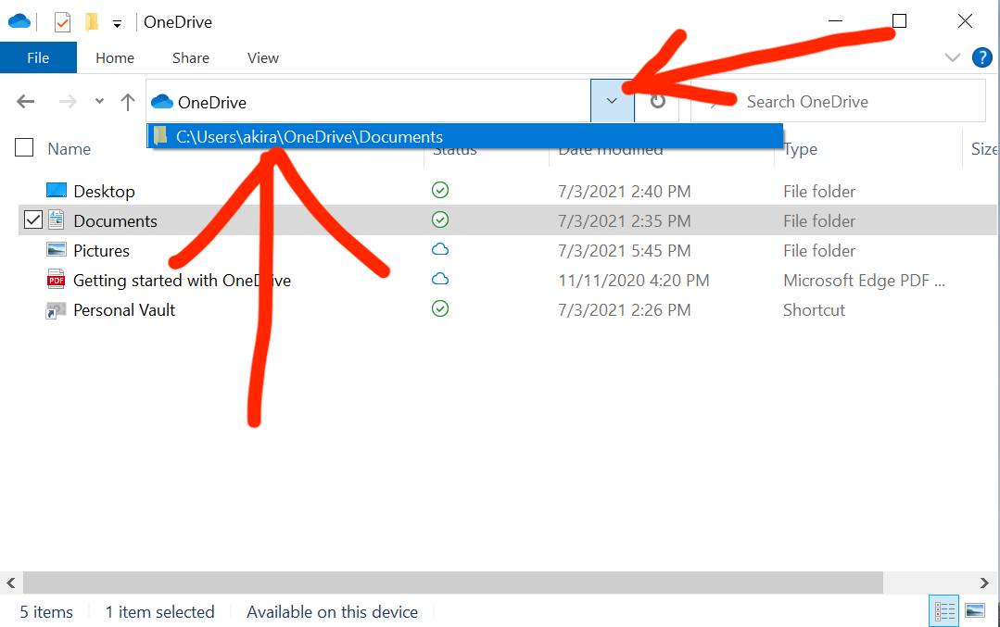

# 👍 Recommended Set-up

## Folder Structure for Coding Basics

In Coding Basics we will be creating many folders and cloning the starter code multiple times. To keep our code organised, we recommend the following folder structure.


All code-related files and folders are in kebab case (hyphenated and lowercase), e.g., `file-name.txt` ,  for ease of use on the command line. It is generally a bad idea to name any files or folders with a space in them, e.g., `file name.txt` , because spaces need to be escaped with backslash (`\`) on the command line.


1. Host all Coding Basics code in a folder called `basics`. Keep this in your `Documents` folder.
2. Within the `basics` folder, for each class session (there are 12 total) in Basics, create a new folder for that day. This means you will have 12 day-specific folders, such as `day1`, `day2`, ..., `day12`.
3. Within each `dayX` folder, create 1 folder for pre-class exercises and another folder for in-class exercises. These can be named  `pre-class` and `in-class`, or any other naming scheme that works for you.
4. Within `pre-class` and `in-class` folders, keep a separate folder for every exercise you do that requires you to create a new Git repository or clone a new copy of the Basics starter code.


As a shortcut, we can run the following command in the terminal to create all the folders.

1. Open the `Documents` folder in VSCode with File > Open Folder and choose `Documents`.
2.  Run the following command.

    ```
    mkdir -p basics/day{1..12}/{in-class,pre-class}
    ```



When cloning the starter code, choose to [name the target folder](../../8-github/4.1-intro-to-github.md#git-clone) to the relevant exercise name. This is so that we do not end up with Git repositories within Git repositories, which can confuse Git and cause issues.



### OneDrive

On Windows computers it may not be clear where a given folder is. Some Windows computers are setup to default to the OneDrive cloud folder. This can be double checked by clicking on the window path location arrow at the top of the window to see the full file location path.


**Don't put your Basics folders in OneDrive.** This makes it harder to access them from the command line.




### Open Basics Folder in VSCode

When working with code, it's often necessary to switch between different files in the same repository, or even across repositories. Instead of using File > Open to open a specific _file_ each time, we can save time by opening the _folder_ that contains all the files we may want to access. We can do this on Windows by going to File > Open Folder, or on Mac with File > Open, and selecting the relevant folder. This will open the folder and its file structure in the VSCode sidebar, allowing us to switch quickly between files in that folder without having to File > Open every time.


For Coding Basics, we recommend storing all of your code in a folder called `basics` as per the [recommended folder structure](https://basics.rocketacademy.co/course-logistics/required-hardware-and-software/required-software-2#suggested-folder-structure-for-coding-basics), and keeping that folder open in VSCode for the duration of the course.



## Window-Snapping Software

On both Windows and Mac there are features to snap windows to standard sizes and places on our screen using keyboard shortcuts. This is especially helpful when coding and we want to view code on one side and documentation on another. The alternative is to manually drag windows and resize them.

**Mac Installation**

Window snapping is not built-in to MacOS, and we will need to download an external program to snap windows. We recommend any of the following.

1. [Rectangle](https://rectangleapp.com) (free) is an actively-maintained open-source window snapping app. We recommend this to start.
2. [Magnet](https://magnet.crowdcafe.com) (S$10.98) is an actively-maintained window snapping app on the Mac App Store. It mostly has the same features as Rectangle, and might be more user-friendly because it's managed through the App Store. From what we can tell, it serves the same function as Rectangle.

