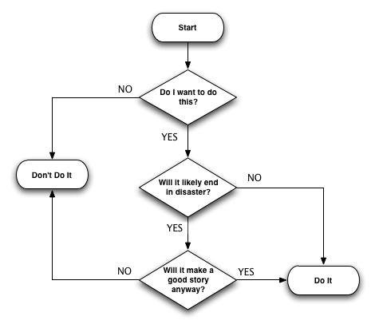

# 3.1.1: Control Flow Diagrams



## Introduction

In engineering disciplines and outside of writing code, control flow diagrams are flow charts used to illustrate if-then-else conditions, case conditions, and repetition or loops.

Before writing any code that represents conditional expressions or repetition, you can use control flow diagrams as a part of your pseudocoding toolkit by drawing them out.

In this section, we will be showing you examples of if-else and loop control flow diagrams.

## If-Else Control Flow

.png>)

A template if-else control flow diagram starts at the point when a "yes / no" question is asked. In programming, this question is also known as an "if-else condition", with the terms `true` representing "yes" and `false` representing "no".

Suppose we want to catch a movie at the theatres: before leaving our house, we will check if it's raining outside. The question "is it raining outside?" meets the requirement of an if-else condition, because you can answer this question with "yes" (or "true") or "no" (or "false").

Based on the answer to this "yes / no" question (or if-else condition), branched decisions will be made. Using the same analogy of catching a movie at the theatres, we will probably not want to go outside if it's raining. Instead, we can stream a movie on Netflix in the comforts of our home.&#x20;

We will only go outside and catch a movie if 's NOT raining. In this scenario, the if-else condition for "is it raining outside?" will be `false`. Following the template if-else control flow diagram above, the decision to "go out and watch a movie in the theatres" will be in the "Else Code Block".

After catching a movie (be it in the theatres, or from streaming one at home), we will continue our other plans for the rest of the day. Represented in the control flow diagram above, this will fall under "Outside If-Else Code Block(s)". This is because this process is AFTER catching a movie, and it may not be dependent on the condition "is it raining outside?"\
\
Putting this analogy together in a control flow diagram, it should look like:

.png>)

## Loop Control Flow

.png>)

Similar to an if-else control flow diagram, a loop control flow starts with a condition that can be evaluated as `true` or `false`. The difference is the decision made and the corresponding actions or logic will be executed repeatedly until the condition is no longer met.

Suppose we are taking a shower and want to wash our hair. Before washing our hair, we have to decide if we feel our hair is dirty. Just like an if-else control flow, the question or condition "does our hair feel dirty?" can be answered with "yes" or "no" (or `true` or `false`).

When washing our hair, we will perform 3 actions: apply shampoo, lather, and then rinse it. After performing these actions, we will check again if our hair feels dirty. If it continues feeling dirty, we will perform the 3 actions again. If not, we will wash the rest of our body.&#x20;

A "loop" happens from checking the condition repeatedly to see if it is still being met, and repeating the actions in the corresponding decision until the condition is no longer met.

Putting this analogy in a control flow diagram, it should look like:

.png>)

## Exercises

1. What other real-life situations can you think of that apply similar decision making processes using if-else or loop conditions? Come up with 1 example each.
2. Draw out the control flow diagrams for your examples in question 1.
